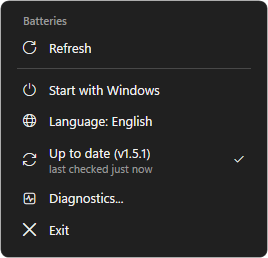

# Contributing to SwarlexBattery

Thank you for helping. This page tells you how to:

1. [Report a device that is missing or shows a wrong level](#1-report-a-device)
2. [Record a USB capture when the protocol is not known](#2-record-a-usb-capture)
3. [Add a device yourself](#3-add-a-device-pull-request)

Before you start, look at the [open issues](../../issues): someone may already be on it.

## 1. Report a device

1. **Update** SwarlexBattery: right-click the tray icon > *Check for updates*.
2. **Close the maker's software** (Synapse, G HUB, iCUE, the web driver and similar). It can hold the
   receiver and stop other programs from reading it.
3. **Wake the device**: move the mouse, press a key, turn the headset on.
4. Right-click the tray icon and select **Diagnostics…**.

   

5. The report opens in Notepad. It is `diagnostics-<date>.txt` in `%APPDATA%\SwarlexBattery` and starts like this:

   ```
   === Shown now ===
   MAD R MAJOR: 100%  (full (on cable))

   === Fresh read of supported devices ===
   atk-373B-mouse 'MAD R MAJOR' mouse 100% chg=True

   === Protocol details (last steps) ===
   atk in: 08 04 00 00 00 02 64 01 10 44 ...

   === All HID devices ===
   VID=373b PID=1040 if=1 usage=ff02:0002 in=17 out=17 feat=0 'MAD 8K DONGLE'
   ```

   For a device that is not supported, **All HID devices** is the most important part: it shows the
   ids (`VID`, `PID`) and the collections (`usage`) of the device.

Then open a [device report](../../issues/new?template=device_request.yml) and:

- write the device name and how it is connected (receiver, cable or Bluetooth);
- drag the newest `diagnostics-….txt` into the form (type `%APPDATA%\SwarlexBattery` in the File Explorer address
  bar to find it). Attach the whole file, not a part of it;
- if the maker's app shows a battery level, write that level next to the one SwarlexBattery shows.

The report contains no personal data: Bluetooth MAC addresses and device serial numbers are replaced
with `xx` automatically.

## 2. Record a USB capture

SwarlexBattery reads a battery only with a **known protocol**: from the maker's documentation, from an
open-source project (OpenRazer, Solaar, HeadsetControl, HaloBattery, …), or from what the maker's own
app sends. It never sends guessed commands, because a wrong command can change a device's settings or
reach its firmware updater.

- **Know a project that reads your device?** Put the link in the issue. That is the fastest way.
- **The maker has a web driver?** (a website that configures the device in the browser, like
  darmoshark.cc) Write its address: its code shows the exact request. The Darmoshark M3 4K was added
  this way.
- **Otherwise**, if the maker's app shows the battery, a capture of that app gives the request and the
  reply:

1. Install [Wireshark](https://www.wireshark.org/download.html) and select **USBPcap** in its installer.
   Restart the computer.
2. **Close the maker's app completely** (also from the tray).
3. Start Wireshark and capture on the **USBPcap** interface with your receiver or cable. If you are not
   sure which one, try each until moving the mouse makes packets appear.
4. **Start the maker's app** and wait until it shows the battery. Open its battery or device page.
5. Wait about 10 seconds, then stop the capture.
6. **File > Save As** `.pcapng`, upload it (Google Drive, WeTransfer, …) and put the link in the issue.

If the capture shows nothing from the app, change one setting (for example the DPI) during the capture
and change it back: that shows whether the capture sees the app at all. USBPcap's
[illustrated guide](https://desowin.org/usbpcap/tour.html) has screenshots of each step.

**Bluetooth devices:** SwarlexBattery shows the level Windows reports. If **Settings > Bluetooth &
devices** shows no battery for your device, SwarlexBattery cannot show one either.

## 3. Add a device (pull request)

Windows 10 / 11 is all you need: `powershell -ExecutionPolicy Bypass -File .\build.ps1` builds
`dist\SwarlexBattery.exe` with the C# compiler that ships with Windows.

1. Fork the repository and branch from the latest `main`.
2. Readers live in `core/Devices.cs` (`Hid.ReadAll` picks them by vendor id); low-level HID access is in
   `core/Hid.cs`. Add a device to the reader of its protocol family; write a new reader only for a new
   protocol.
3. **Name the source** of every command in a comment above the reader (project, file and line, web
   driver, or your capture). Send only read-only battery / status queries.
4. **Never invent a value.** A device that does not answer, or answers something implausible, gets
   `Level = -1`. Check what you can: the echoed command, a checksum, plausible fields.
5. The compiler is the .NET Framework one (C# 5): no `$"..."`, no `?.`, no `=>` members. New texts go
   to both `lang/en.json` and `lang/tr.json`.
6. Test on real hardware if you can. Otherwise check the parser with frames from your source or
   capture, and say so in the pull request.
7. Add a line to `docs/CHANGELOG.md` and the device to the table in `README.md`.

In the pull request, write which issue it closes, the source of the protocol, and whether (and with
which device) you tested it on real hardware.
