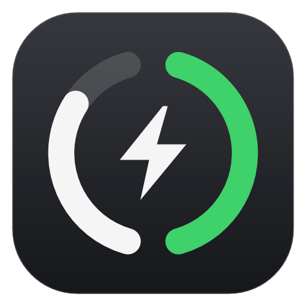

<p align="center"></p>

# SwarlexBattery

Battery levels of your wireless mouse, keyboard and headset in the Windows system tray, without
vendor software. One icon next to the clock: the left half of the ring is the mouse, the right half
the headset. A bolt appears while charging and the icon dims while a device sleeps.
Left click shows the details, right click opens the menu.

- Single portable `SwarlexBattery.exe` (about 250 KB), nothing to install
- English and Turkish (follows the Windows display language; switch from the menu)
- Updates itself from GitHub Releases, after you click "Update"
- Free and open source under the GNU GPL v3

**[Download the latest release](https://github.com/swarlex/SwarlexBattery/releases/latest)**: get
`SwarlexBattery.exe`, put it in a folder you keep (for example `%LOCALAPPDATA%\Programs\SwarlexBattery`),
run it, and enable *Start with Windows* from the right-click menu.

> The exe is not code-signed. Windows SmartScreen may warn on first launch
> (*More info* > *Run anyway*). You can also build it yourself from this source, see [Building](#building).

## Supported devices

| Brand | Devices | Method |
|---|---|---|
| Razer | BlackShark V2 HyperSpeed (dongle and cable), BlackShark V2 Pro, wireless Razer mice and keyboards | MediaTek frames / "PA" frames / 90-byte feature report |
| Logitech | Mice and keyboards on Lightspeed, Unifying and Bolt receivers, cabled G series, G533/535/633/635/733/933/935, G PRO X (2) | HID++ 2.0 |
| SteelSeries | Arctis Nova 7 / 7X / 7P / 5 / 3, Arctis 7+, GameBuds, Nova Pro Wireless, Aerox 3/5/9, Rival 3 Wireless | vendor queries |
| HyperX | Cloud II Wireless, Cloud III Wireless, Cloud Alpha 2 | vendor queries |
| Corsair | Void v2 Wireless, Virtuoso Max, HS80 Max | vendor queries |
| ATK / VXE / Pulsar / Hitscan | MAD series and other mice using the same 17-byte protocol (receiver and cable) | power query |
| Others | Bluetooth devices whose battery Windows Settings shows, Xbox / XInput controllers, laptop battery | Windows APIs |

Only the Razer BlackShark V2 HyperSpeed and a VXE MAD mouse have been tested on real hardware so far.
The other readers follow published protocol documentation; reports (working or not) are welcome in
[Issues](https://github.com/swarlex/SwarlexBattery/issues).

Your device is not listed? Put a script in `%APPDATA%\SwarlexBattery\gadgets\collectors.d\` that prints a JSON array:
```json
[{"id":"speaker","name":"Speaker","kind":"speaker","pct":64,"charging":false}]
```

## How honest are the numbers?

- A value is shown **only when the device itself answered**. Nothing is estimated or made up.
- If an answer is missed, the last reading stays for 45 seconds; after that the device is shown
  dimmed as *asleep* with the age of its last reading, and it disappears after 24 hours.
- Devices that only report coarse levels (for example 4-step headsets, or Logitech values computed
  from the battery voltage) are marked *approximate* in the panel and with `~` in the tooltip.
- Wireless dongles sometimes repeat the old value of a device that is switched off. SwarlexBattery
  asks the BlackShark whether the headset is linked and checks the battery voltage of ATK mice;
  answers that fail these checks are not shown.
- A device on its cable at 100 % is shown as *full*, not *charging*.
- Batteries are read every 10 seconds, and 1.5 seconds after a device or cable is plugged in or out.

Only read-only battery and status queries are sent to devices. Device settings are never changed.

## Updates

SwarlexBattery checks the latest release of this repository at start and every 6 hours. When a newer
version exists it shows a notification and an **Update** item at the top of the right-click menu.
Clicking it downloads the new `SwarlexBattery.exe`, verifies it against the `SwarlexBattery.exe.sha256`
published with the same release, swaps it in and restarts. Nothing is installed without your click.
*Check for updates* in the menu checks right away. See [SECURITY.md](SECURITY.md) for details.

## Settings

`%APPDATA%\SwarlexBattery\config.json`:

| Setting | Effect |
|---|---|
| `"language": "en"` / `"tr"` / `"auto"` | interface language (also in the right-click menu) |
| `"plugins": { "gadgets": { "combine": false } }` | one tray icon per device |
| `"plugins": { "gadgets": { "lowThreshold": 20 } }` | low battery notification threshold (%) |
| `"monochrome": false` | coloured icons (orange / red when low, green while charging) |
| `"quietWhileGaming": false` | also notify while a fullscreen app is in front |
| `"update": { "check": false }` | turn off the automatic update check |

Log file: `%LOCALAPPDATA%\SwarlexBattery\swarlexbattery.log`

## Building

Requirements: Windows 10 or 11. The C# compiler that ships with Windows (.NET Framework 4.x) is used;
nothing has to be downloaded.

```powershell
powershell -ExecutionPolicy Bypass -File .\build.ps1     # -> dist\SwarlexBattery.exe (+ .sha256)
```

Publishing a release (maintainers, needs the GitHub CLI signed in with `gh auth login`):
```powershell
.\tools\release.ps1 -Notes "What changed"                   # patch: 1.2.0 -> 1.2.1
.\tools\release.ps1 -Version 1.3.0 -Notes "What changed"
```
It raises `VERSION`, builds, commits, pushes and creates the GitHub release with the exe and its checksum.
If the build fails, nothing is pushed.

### Project layout
- `SwarlexBattery.ps1`: host (tray icon, flyout, menu, languages, updater)
- `core/Devices.cs`, `core/Hid.cs`: vendor battery protocols over HID
- `core/Native.cs`: Win32 helpers; `core/Launcher.cs`: exe entry point
- `plugins/gadgets`: the battery plugin; `lang/`: interface texts

## Türkçe

SwarlexBattery, kablosuz mouse, klavye ve kulaklık pillerini üretici yazılımı olmadan Windows sistem
tepsisinde gösterir. Arayüz Windows dili Türkçeyse Türkçe açılır; sağ tık menüsündeki *Dil* ile
değiştirilebilir. [Son sürümü indir](https://github.com/swarlex/SwarlexBattery/releases/latest).

## License

SwarlexBattery is free software: you can redistribute it and/or modify it under the terms of the
GNU General Public License as published by the Free Software Foundation, either version 3 of the
License, or (at your option) any later version. See [LICENSE](LICENSE).

Device protocols are adapted from the documentation and code of other open source projects; see
[THIRD_PARTY_NOTICES.md](THIRD_PARTY_NOTICES.md).
