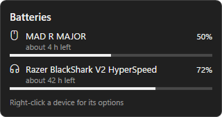
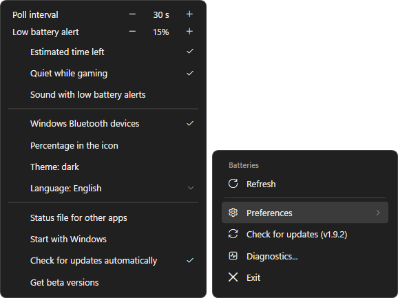
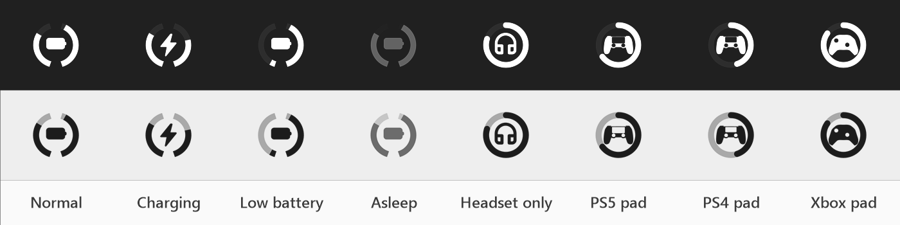

<p align="center">
  
</p>

<p align="center">
  <a href="https://github.com/swarlex/SwarlexBattery/releases/latest"></a>
  
  <a href="LICENSE"></a>
</p>

<p align="center">
  <a href="https://github.com/swarlex/SwarlexBattery/releases/latest/download/SwarlexBattery-Setup.exe"><b>⬇ Download SwarlexBattery-Setup.exe</b></a>
  <br>
  <sub>Installs per user · no administrator rights · updates itself</sub>
</p>

<p align="center">
  <a href="#install">Install</a> · <a href="#supported-devices">Supported devices</a> ·
  <a href="docs/CHANGELOG.md">Changelog</a> · <a href="#license">License</a>
</p>

---

The battery of your wireless **mouse, keyboard and headset** next to the clock, without vendor
software running in the background. One small icon: the left half of the ring is the mouse, the
right half the headset. Left click for details, right click for the menu and *Preferences*; right-click a
device in the panel to rename it, give it another icon or hide it.

<p align="center">
  <picture>
    <source media="(prefers-color-scheme: light)" srcset="docs/images/panel-light.png">
    
  </picture>
</p>

<p align="center">
  <picture>
    <source media="(prefers-color-scheme: light)" srcset="docs/images/menu-prefs-light.png">
    
  </picture>
</p>

<p align="center">
  
</p>

- **Honest numbers:** a level is shown only when the device itself answered; levels are never made up. The
  time left is an estimate from how fast each device drains now, and says "about".
- **Light:** one small C# program, about 10 MB of memory, no services, no vendor software.
- **Low battery notifications**, quiet while a fullscreen game is running.
- **Updates itself** from this page when you click *Update* (SHA-256 checked).
- **Light and dark** like your taskbar; **English, Turkish, German, Spanish and Italian**; free and open source (GPL-3.0).

## Install

Download **[SwarlexBattery-Setup.exe](https://github.com/swarlex/SwarlexBattery/releases/latest/download/SwarlexBattery-Setup.exe)**
and run it. It installs for your user only, without administrator rights. Running it again upgrades
and keeps your settings; uninstall from **Settings > Apps**.

> [!NOTE]
> The files are not code-signed: Windows SmartScreen may warn on the first launch (*More info* > *Run
> anyway*), and antivirus programs with machine-learning detection (e.g. Malwarebytes
> `MachineLearning/Anomalous`) may flag a new release as a false positive. You can check every release
> on VirusTotal or [build it yourself](#building).

<details>
<summary>Portable version, silent install</summary>

- **Portable:** `SwarlexBattery.exe` from the release runs without installing; enable *Start with
  Windows* from its menu. Put an empty `portable.txt` next to it and the settings, log and battery history
  are kept in a `data` folder beside the exe instead of `%APPDATA%` (e.g. on a USB stick).
- **Silent install:** `SwarlexBattery-Setup.exe /silent [/dir:<folder>] [/noautostart] [/lang:en|tr|de|es|it]`
- **Silent uninstall:** `"%LOCALAPPDATA%\Programs\SwarlexBattery\Uninstall.exe" /uninstall /silent`
</details>

## Supported devices

| Brand | Devices |
|---|---|
| **Razer** | BlackShark V2 HyperSpeed / V2 Pro, Barracuda Pro, wireless Razer mice; DeathStalker V2 Pro, BlackWidow HyperSpeed and V3 Pro keyboards |
| **Logitech / Astro** | Mice and keyboards on Lightspeed, Unifying and Bolt receivers; G533 / 535 / 633 / 635 / 733 / 933 / 935, G PRO X (2) headsets, G PRO X 2 LIGHTSPEED (Centurion); Astro A50 Gen 5 |
| **SteelSeries** | Arctis Nova 7 / 7X / 7P / 5 / 3, Arctis 7+, Arctis Nova Pro Wireless, Arctis Nova Elite, GameBuds, Arctis 1 / 7 / 7P / 7X / 9 / Pro Wireless (2019); Aerox 3 / 5 / 9, Rival 3 Wireless |
| **HyperX** | Cloud II Wireless, Cloud III Wireless, Cloud III S Wireless, Cloud Alpha 2 |
| **Corsair** | Void v2 Wireless, Virtuoso Max, HS80 Max |
| **ATK / VXE / Pulsar** | MAD series and mice with the same protocol |
| **ASUS** | ROG Gladius III, Chakram (X), Keris, Harpe Ace, Spatha X, Pugio II, Strix Impact II Wireless; TUF M4 Wireless and more |
| **WLmouse / LAMZU / G-Wolves** | Beast X (Max / Mini Pro), Maya X; G-Wolves on the shared 8K receiver (HTS Plus, Lycan, HTXU, Fenrir, HTX Mini, WARG) and the models with a receiver of their own (HSK Pro / Plus / Lite / ACE, HTS, HTX, HTR, HT-S2, Fenrir, VUK, HTM Plus) |
| **MCHOSE / AM Infinity** | M7 / L7 / A7 family, G7; AM Infinity 8K |
| **Audeze / JBL** | Maxwell (and Maxwell 2), Quantum 910 Wireless |
| **Keyboards** | AULA F75 (2.4 GHz), Keychron (Ultra-Link 8K, M5 mouse), Lofree Hyzen; Razer and Logitech wireless keyboards |
| **Darmoshark** | M3 4K on the 4K receiver; M3, M3S, N3 |
| **Controllers** | PS5 DualSense / Edge, PS4 DualShock 4, Xbox (USB, wireless adapter, Bluetooth), Switch Pro / Joy-Con, 8BitDo, and other pads in Xbox (XInput) mode |
| **Others** | Bluetooth devices whose battery Windows shows, laptop battery |

Tested on real hardware: Razer BlackShark V2 HyperSpeed, VXE MAD 8K and Darmoshark M3 4K; the other readers follow
published protocols. **Not working for you?** Right-click the tray icon > *Diagnostics…* and attach the file to a
[device report](https://github.com/swarlex/SwarlexBattery/issues/new?template=device_request.yml). How to add a device:
[CONTRIBUTING](.github/CONTRIBUTING.md).

<details>
<summary>Known limits</summary>

- **Logitech G435** on its USB receiver: the receiver gives no battery level (Logitech G HUB shows none
  either). Over Bluetooth it appears when Windows shows its battery.
- **AULA F75** on its cable and the **Darmoshark 4K** while charging report no level: the last reading
  is shown as charging, marked `~`.
- Coarse levels (4-step headsets, Logitech voltage readings) are marked *approximate* (`~`).
- **PlayStation and 8BitDo controllers on Bluetooth** show their level only while Steam or a game uses
  them: switching them to the report with the battery ourselves would stop some games from reading the
  controller until it is turned off. On USB they always show it. Xbox pads report four steps (`~`).
- A device that stops answering keeps its last value for 45 s, is then shown dimmed as *asleep*, and
  disappears after 24 hours.
</details>

<details>
<summary>Settings</summary>

Right-click > *Preferences* has the poll interval and the low battery level (- / +), *Estimated time left*,
*Quiet while gaming*, *Sound with low battery alerts*, *Windows Bluetooth devices*, *Keep the icon next to the
clock*, *Percentage in the icon*, *Coloured icon*, the charging and opening animations,
the theme, the status file, *Start with Windows* and the update settings; *Language* is in the menu. Right-click a device
in the panel to rename it, choose its icon, give it its own low battery level or hide it; hidden devices come
back from the menu's *Hidden
devices*. All of it is kept in `%APPDATA%\SwarlexBattery\config.json`, which also takes:

| Setting | Effect |
|---|---|
| `"language": "auto"` / `"en"` / `"tr"` / `"de"` / `"es"` / `"it"` | interface language |
| `"theme": { "mode": "dark" }` | always dark (`"light"`: always light; `"auto"`: like the taskbar) |
| `"plugins": { "gadgets": { "combine": false } }` | one tray icon per device |
| `"plugins": { "gadgets": { "lowThreshold": 20 } }` | low battery notification threshold (%) |
| `"plugins": { "gadgets": { "interval": 60 } }` | seconds between battery reads (default 30; 5 while the panel is open) |
| `"monochrome": false` | coloured icons |
| `"quietWhileGaming": false` | notify during fullscreen apps too |
| `"lowSound": true` | a sound with low battery alerts (also in the right-click menu) |
| `"update": { "check": false }` | no automatic update check |
| `"statusFile": true` | write every level to `%APPDATA%\SwarlexBattery\status.json` for Rainmeter, Stream Deck or scripts |
| `"plugins": { "gadgets": { "timeLeft": false } }` | no "time left" estimate |

Other programs can add devices through `%APPDATA%\SwarlexBattery\gadgets\external.json`:
`[{"id": "speaker", "name": "Speaker", "kind": "speaker", "pct": 64, "charging": false}]`
</details>

<details>
<summary id="building">Building</summary>

Windows 10 / 11 is all you need: the build uses the C# compiler that ships with Windows.

```powershell
powershell -ExecutionPolicy Bypass -File .\build.ps1
```

`core/` holds the app (`Devices.cs` / `Hid.cs` are the device protocols), `lang/` the texts and `tests/` the
tests. `build.ps1` runs them on every build (protocol replies captured on real devices, what the panel shows,
every language); a failing test stops the build.
Maintainers release with `.\tools\release.ps1 -Notes "..."` (GitHub CLI).
</details>

## Code signing policy

Release files are built from this repository by GitHub Actions ([build workflow](.github/workflows/build.yml)),
so every binary can be traced back to its source. Code signing through the SignPath Foundation is requested;
until it is granted, releases are not signed.

| Role | Who |
|---|---|
| Authors (change the code) | [swarlex](https://github.com/swarlex) |
| Reviewers (approve changes from others) | [swarlex](https://github.com/swarlex) |
| Approvers (approve each signed release) | [swarlex](https://github.com/swarlex) |

**Privacy:** this program will not transfer any information to other networked systems unless
specifically requested by the user, except for the check for a new release on GitHub, which can be turned
off. Details: [privacy policy](docs/PRIVACY.md).

## License

<a href="https://www.gnu.org/licenses/gpl-3.0.html"></a>

SwarlexBattery is free software under the [GNU General Public License v3.0](LICENSE) or (at your option)
any later version. Some device code is adapted from MIT-licensed projects:
[third-party notices](docs/THIRD_PARTY_NOTICES.md). Found a security problem? See the
[security policy](.github/SECURITY.md). Want to add a device? See
[CONTRIBUTING](.github/CONTRIBUTING.md).

Made by [swarlex](https://github.com/swarlex), built together with [Claude](https://claude.ai) in
[Claude Code](https://claude.com/claude-code).

<br clear="right">
