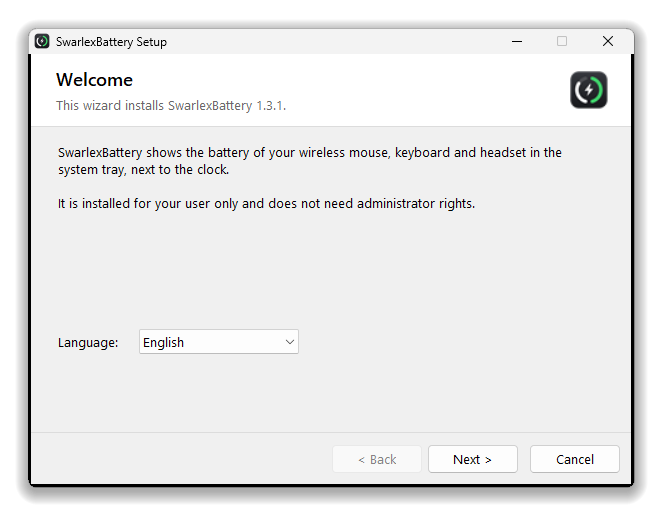
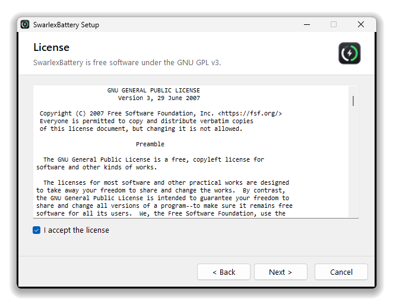
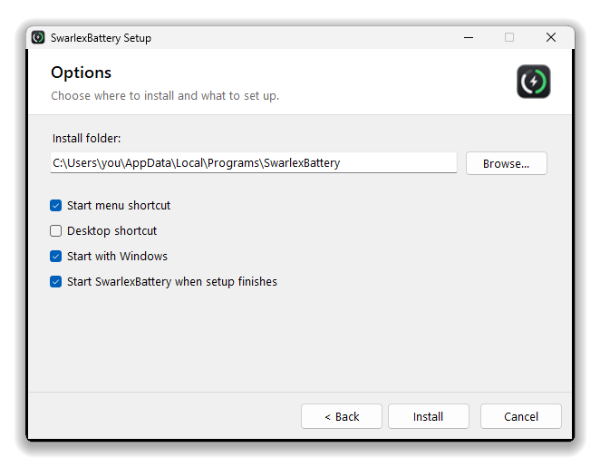

<p align="center">
  
</p>

<p align="center">
  <a href="https://github.com/swarlex/SwarlexBattery/releases/latest"></a>
  <a href="https://github.com/swarlex/SwarlexBattery/releases"></a>
  
  <a href="LICENSE"></a>
</p>

<p align="center">
  <a href="https://github.com/swarlex/SwarlexBattery/releases/latest/download/SwarlexBattery-Setup.exe"><b>Download SwarlexBattery-Setup.exe</b></a>
  &nbsp;·&nbsp; <a href="#install">Install</a>
  &nbsp;·&nbsp; <a href="#supported-devices">Supported devices</a>
  &nbsp;·&nbsp; <a href="CHANGELOG.md">Changelog</a>
  &nbsp;·&nbsp; <a href="#türkçe">Türkçe</a>
</p>

---

SwarlexBattery shows the battery of your wireless **mouse, keyboard and headset** next to the clock,
without vendor software running in the background. One small icon: the left half of the ring is the
mouse, the right half the headset. Left click for details, right click for the menu.

<p align="center">
  
  &nbsp;&nbsp;
  
</p>

<p align="center">
  
</p>

## Features

- **One tray icon** for mouse and headset, white like the Windows icons (black on a light taskbar).
  A bolt while charging, dimmed while a device sleeps, a notification when a battery runs low.
- **Talks to the devices directly** over HID: Razer, Logitech, SteelSeries, HyperX, Corsair, ATK / VXE
  and more, plus Bluetooth devices, Xbox controllers and the laptop battery.
- **Honest numbers**: a value is shown only when the device itself answered (see [below](#how-honest-are-the-numbers)).
- **Small and light**: about 200 KB, no runtime to install, nothing running besides the tray icon.
- **English and Turkish**, following the Windows display language.
- **Updates itself** from GitHub Releases when you click *Update*, with a SHA-256 check.
- **Free and open source** under the GNU GPL v3.

## Install

1. Download **[SwarlexBattery-Setup.exe](https://github.com/swarlex/SwarlexBattery/releases/latest/download/SwarlexBattery-Setup.exe)**
   from the [latest release](https://github.com/swarlex/SwarlexBattery/releases/latest).
2. Run it and follow the wizard. It installs for your user only, **without administrator rights**,
   into `%LOCALAPPDATA%\Programs\SwarlexBattery`, and can add Start menu / desktop shortcuts and
   start SwarlexBattery with Windows.
3. The battery icon appears next to the clock.

Running the setup again upgrades an existing install and keeps your settings. To uninstall, use
**Settings > Apps > SwarlexBattery**; you are asked whether to delete your settings too.

<p align="center">
  
  
  
</p>

<details>
<summary>Portable version and silent install</summary>

- **Portable:** `SwarlexBattery.exe` from the same release runs without installing. Put it in a folder
  you keep, run it, and enable *Start with Windows* from the right-click menu.
- **Silent install:** `SwarlexBattery-Setup.exe /silent [/dir:<folder>] [/noautostart] [/lang:en|tr]`
- **Silent uninstall:** `"%LOCALAPPDATA%\Programs\SwarlexBattery\Uninstall.exe" /uninstall /silent`
</details>

> [!NOTE]
> The files are not code-signed, so Windows SmartScreen may warn on the first launch
> (*More info* > *Run anyway*). You can also [build them yourself](#building) from this source.

## Supported devices

| Brand | Devices |
|---|---|
| **Razer** | BlackShark V2 HyperSpeed (dongle and cable), BlackShark V2 Pro, wireless Razer mice and keyboards |
| **Logitech** | Mice and keyboards on Lightspeed, Unifying and Bolt receivers; cabled G series; G533 / 535 / 633 / 635 / 733 / 933 / 935, G PRO X (2) headsets |
| **SteelSeries** | Arctis Nova 7 / 7X / 7P / 5 / 3, Arctis 7+, GameBuds, Arctis Nova Pro Wireless; Aerox 3 / 5 / 9 and Rival 3 Wireless mice |
| **HyperX** | Cloud II Wireless, Cloud III Wireless, Cloud Alpha 2 |
| **Corsair** | Void v2 Wireless, Virtuoso Max, HS80 Max |
| **ATK / VXE / Pulsar / Hitscan** | MAD series and other mice using the same protocol (receiver and cable) |
| **Others** | Bluetooth devices whose battery Windows Settings shows, Xbox / XInput controllers, laptop battery |

**Not possible yet:** the Logitech G435 on its USB receiver. The receiver does not speak HID++, and the
only known way to read its battery interrupts the audio (Logitech G HUB does not show it either). Over
Bluetooth it appears if Windows Settings shows its battery.

So far the Razer BlackShark V2 HyperSpeed and a VXE MAD mouse are tested on real hardware; the other
readers follow published protocol documentation. **Does yours work, or not?** Please tell us with a
[device report](https://github.com/swarlex/SwarlexBattery/issues/new?template=device_request.yml).

<details>
<summary>Your device is not listed? Feed it from another program</summary>

Any program can write `%APPDATA%SwarlexBatterygadgetsexternal.json`; SwarlexBattery shows what it contains:

```json
[{"id": "speaker", "name": "Speaker", "kind": "speaker", "pct": 64, "charging": false, "ts": 1760000000, "ttl": 300}]
```

`ts` (Unix seconds) and `ttl` are optional: an entry older than `ttl` seconds counts as disconnected.

`kind` is one of `mouse`, `keyboard`, `headphones`, `earbuds`, `gamepad`, `speaker`, `phone`, `watch`.
</details>

## How honest are the numbers?

- A value is shown **only when the device itself answered**. Nothing is estimated or made up.
- A missed answer keeps the last reading for 45 seconds; after that the device is shown dimmed as
  *asleep* with the age of its last reading, and it disappears after 24 hours.
- Devices that only report coarse levels (4-step headsets, Logitech values computed from the battery
  voltage) are marked *approximate* in the panel and with `~` in the tooltip.
- Wireless dongles sometimes repeat the old value of a device that is switched off. SwarlexBattery asks
  the BlackShark whether the headset is linked and checks the battery voltage of ATK mice; answers that
  fail these checks are not shown.
- A device on its cable at 100 % is shown as *full*, not *charging*.
- Batteries are read every 10 seconds, and 1.5 seconds after a device or cable is plugged in or out.

Only **read-only** battery and status queries are sent to devices; their settings are never changed.

## Updates

SwarlexBattery checks the latest release of this repository at start and every 6 hours (through the
release page, so the GitHub API rate limit does not apply). When a newer
version exists it shows a notification and an **Update** item at the top of the right-click menu.
Clicking it downloads the new version, verifies it against the SHA-256 published with the same release,
swaps it in and restarts. Nothing is installed without your click. See [SECURITY.md](SECURITY.md).

## Settings

Right-click menu: *Start with Windows*, *Language*, *Check for updates*. Everything else is in
`%APPDATA%\SwarlexBattery\config.json`:

| Setting | Effect |
|---|---|
| `"language": "en"` / `"tr"` / `"auto"` | interface language |
| `"plugins": { "gadgets": { "combine": false } }` | one tray icon per device |
| `"plugins": { "gadgets": { "lowThreshold": 20 } }` | low battery notification threshold (%) |
| `"monochrome": false` | coloured icons (orange / red when low, green while charging) |
| `"quietWhileGaming": false` | also notify while a fullscreen app is in front |
| `"update": { "check": false }` | turn off the automatic update check |

Log file: `%LOCALAPPDATA%\SwarlexBattery\swarlexbattery.log`

## Building

Windows 10 or 11 is all you need: the build uses the C# compiler that ships with Windows (.NET Framework 4.x).

```powershell
powershell -ExecutionPolicy Bypass -File .\build.ps1
# -> dist\SwarlexBattery-Setup.exe, dist\SwarlexBattery.exe, dist\SwarlexBattery.exe.sha256
```

<details>
<summary>Project layout and releasing</summary>

| Path | What it is |
|---|---|
| `core/App.cs`, `core/Host.cs` | entry point, settings, texts; timers and notifications |
| `core/Batteries.cs` | battery sources and what the tray / flyout show |
| `core/Tray.cs`, `core/Flyout.cs` | tray icon, battery panel and menu |
| `core/Updater.cs` | updates from GitHub Releases |
| `core/Devices.cs`, `core/Hid.cs` | vendor battery protocols over HID |
| `core/Native.cs` | Win32 helpers |
| `core/Setup.cs` | install wizard and uninstaller |
| `lang/` | interface texts (English, Turkish) |

Maintainers publish with the GitHub CLI (`gh auth login`):

```powershell
.\tools\release.ps1 -Notes "What changed"                   # patch: 1.3.1 -> 1.3.2
.\tools\release.ps1 -Version 1.4.0 -Notes "What changed"
```

It raises `VERSION`, builds, commits, pushes and creates the GitHub release. If the build fails, nothing is pushed.
</details>

## Contributing

Bug reports, device reports and pull requests are welcome. For a new device, the
[device report](https://github.com/swarlex/SwarlexBattery/issues/new?template=device_request.yml)
form explains how to find its USB ids. Security problems: please use a
[private advisory](https://github.com/swarlex/SwarlexBattery/security/advisories/new).

## Türkçe

SwarlexBattery, kablosuz **mouse, klavye ve kulaklık** pillerini üretici yazılımı olmadan, saatin
yanında tek bir ikonla gösterir. Halkanın sol yarısı mouse, sağ yarısı kulaklık; şarj olurken
şimşek çıkar, cihaz uyurken ikon soluklaşır.

- **Kurulum:** [SwarlexBattery-Setup.exe](https://github.com/swarlex/SwarlexBattery/releases/latest/download/SwarlexBattery-Setup.exe)
  dosyasını indirip çalıştır. Sihirbaz Türkçedir ve yönetici izni istemez.
- **Dil:** Windows dili Türkçeyse Türkçe açılır; sağ tık menüsündeki *Dil* ile değiştirilebilir.
- **Güncelleme:** Yeni sürüm çıkınca sağ tık menüsünde *Güncelle* görünür.
- **Kaldırma:** Ayarlar > Uygulamalar > SwarlexBattery.
- Cihazın çalışmıyorsa bir [cihaz bildirimi](https://github.com/swarlex/SwarlexBattery/issues/new?template=device_request.yml) aç.

## License

SwarlexBattery is free software: you can redistribute it and/or modify it under the terms of the
GNU General Public License as published by the Free Software Foundation, either version 3 of the
License, or (at your option) any later version. See [LICENSE](LICENSE).

Device protocols are adapted from the documentation and code of other open source projects; see
[THIRD_PARTY_NOTICES.md](THIRD_PARTY_NOTICES.md).
