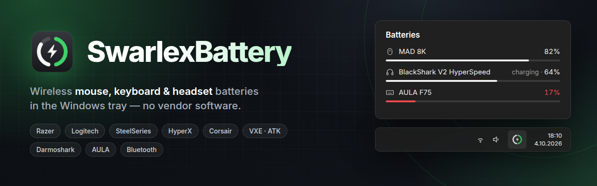
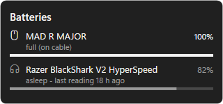
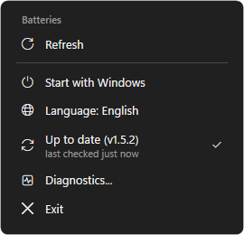
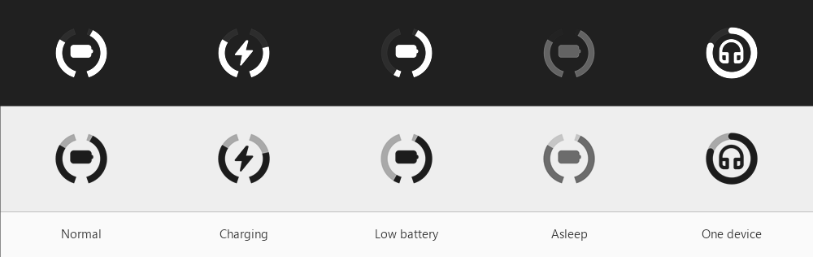

<p align="center">
  
</p>

<p align="center">
  <a href="https://github.com/swarlex/SwarlexBattery/releases/latest"></a>
  
  <a href="LICENSE"></a>
</p>

<p align="center">
  <a href="https://github.com/swarlex/SwarlexBattery/releases/latest/download/SwarlexBattery-Setup.exe"><b>⬇ Download SwarlexBattery-Setup.exe</b></a>
  <br>
  <sub>Installs per user · no administrator rights · updates itself</sub>
</p>

<p align="center">
  <a href="#install">Install</a> · <a href="#supported-devices">Supported devices</a> ·
  <a href="docs/CHANGELOG.md">Changelog</a> · <a href="#license">License</a>
</p>

---

The battery of your wireless **mouse, keyboard and headset** next to the clock, without vendor
software running in the background. One small icon: the left half of the ring is the mouse, the
right half the headset. Left click for details, right click for the menu.

<p align="center">
  
  &nbsp;&nbsp;
  
</p>

<p align="center">
  
</p>

- **Honest numbers:** a value is shown only when the device itself answered; nothing is estimated.
- **Light:** one small C# program, about 10 MB of memory, no services, no vendor software.
- **Low battery notifications**, quiet while a fullscreen game is running.
- **Updates itself** from this page when you click *Update* (SHA-256 checked).
- **English and Turkish**, free and open source (GPL-3.0).

## Install

Download **[SwarlexBattery-Setup.exe](https://github.com/swarlex/SwarlexBattery/releases/latest/download/SwarlexBattery-Setup.exe)**
and run it. It installs for your user only, without administrator rights. Running it again upgrades
and keeps your settings; uninstall from **Settings > Apps**.

> [!NOTE]
> The files are not code-signed: Windows SmartScreen may warn on the first launch (*More info* > *Run
> anyway*), and antivirus programs with machine-learning detection (e.g. Malwarebytes
> `MachineLearning/Anomalous`) may flag a new release as a false positive. You can check every release
> on VirusTotal or [build it yourself](#building).

<details>
<summary>Portable version, silent install</summary>

- **Portable:** `SwarlexBattery.exe` from the release runs without installing; enable *Start with
  Windows* from its menu.
- **Silent install:** `SwarlexBattery-Setup.exe /silent [/dir:<folder>] [/noautostart] [/lang:en|tr]`
- **Silent uninstall:** `"%LOCALAPPDATA%\Programs\SwarlexBattery\Uninstall.exe" /uninstall /silent`
</details>

## Supported devices

| Brand | Devices |
|---|---|
| **Razer** | BlackShark V2 HyperSpeed / V2 Pro, wireless Razer mice and keyboards |
| **Logitech** | Mice and keyboards on Lightspeed, Unifying and Bolt receivers; G533 / 535 / 633 / 635 / 733 / 933 / 935, G PRO X (2) headsets |
| **SteelSeries** | Arctis Nova 7 / 7X / 7P / 5 / 3, Arctis 7+, Arctis Nova Pro Wireless, GameBuds; Aerox 3 / 5 / 9, Rival 3 Wireless |
| **HyperX** | Cloud II Wireless, Cloud III Wireless, Cloud Alpha 2 |
| **Corsair** | Void v2 Wireless, Virtuoso Max, HS80 Max |
| **ATK / VXE / Pulsar** | MAD series and mice with the same protocol |
| **AULA** | F75 on its 2.4 GHz receiver |
| **Darmoshark** | M3 4K on the 4K receiver; M3, M3S, N3 |
| **Controllers** | PS5 DualSense / Edge, PS4 DualShock 4, Xbox (USB, wireless adapter, Bluetooth), Switch Pro / Joy-Con, 8BitDo, and other pads in Xbox (XInput) mode |
| **Others** | Bluetooth devices whose battery Windows shows, laptop battery |

Tested on real hardware: Razer BlackShark V2 HyperSpeed, VXE MAD 8K and Darmoshark M3 4K; the other readers follow
published protocols. **Not working for you?** Right-click the tray icon > *Diagnostics…* and attach the file to a
[device report](https://github.com/swarlex/SwarlexBattery/issues/new?template=device_request.yml). How to add a device:
[CONTRIBUTING](.github/CONTRIBUTING.md).

<details>
<summary>Known limits</summary>

- **Logitech G435** on its USB receiver: the receiver gives no battery level (Logitech G HUB shows none
  either). Over Bluetooth it appears when Windows shows its battery.
- **AULA F75** on its cable and the **Darmoshark 4K** while charging report no level: the last reading
  is shown as charging, marked `~`.
- Coarse levels (4-step headsets, Logitech voltage readings) are marked *approximate* (`~`).
- **PlayStation and 8BitDo controllers on Bluetooth** show their level only while Steam or a game uses
  them: switching them to the report with the battery ourselves would stop some games from reading the
  controller until it is turned off. On USB they always show it. Xbox pads report four steps (`~`).
- A device that stops answering keeps its last value for 45 s, is then shown dimmed as *asleep*, and
  disappears after 24 hours.
</details>

<details>
<summary>Settings</summary>

The right-click menu has *Start with Windows*, *Language* and *Check for updates*. More in
`%APPDATA%\SwarlexBattery\config.json`:

| Setting | Effect |
|---|---|
| `"language": "en"` / `"tr"` / `"auto"` | interface language |
| `"plugins": { "gadgets": { "combine": false } }` | one tray icon per device |
| `"plugins": { "gadgets": { "lowThreshold": 20 } }` | low battery notification threshold (%) |
| `"plugins": { "gadgets": { "interval": 60 } }` | seconds between battery reads (default 30; 5 while the panel is open) |
| `"monochrome": false` | coloured icons |
| `"quietWhileGaming": false` | notify during fullscreen apps too |
| `"update": { "check": false }` | no automatic update check |

Other programs can add devices through `%APPDATA%\SwarlexBattery\gadgets\external.json`:
`[{"id": "speaker", "name": "Speaker", "kind": "speaker", "pct": 64, "charging": false}]`
</details>

<details>
<summary id="building">Building</summary>

Windows 10 / 11 is all you need: the build uses the C# compiler that ships with Windows.

```powershell
powershell -ExecutionPolicy Bypass -File .\build.ps1
```

`core/` holds the app (`Devices.cs` / `Hid.cs` are the device protocols), `lang/` the texts.
Maintainers release with `.\tools\release.ps1 -Notes "..."` (GitHub CLI).
</details>

## License

<a href="https://www.gnu.org/licenses/gpl-3.0.html"></a>

SwarlexBattery is free software under the [GNU General Public License v3.0](LICENSE) or (at your option)
any later version. Some device code is adapted from MIT-licensed projects:
[third-party notices](docs/THIRD_PARTY_NOTICES.md). Found a security problem? See the
[security policy](.github/SECURITY.md). Want to add a device? See
[CONTRIBUTING](.github/CONTRIBUTING.md).

Made by [swarlex](https://github.com/swarlex), built together with [Claude](https://claude.ai) in
[Claude Code](https://claude.com/claude-code).

<br clear="right">
